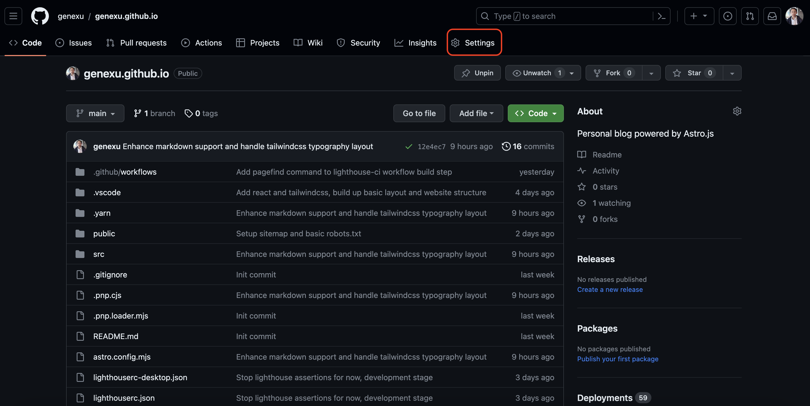
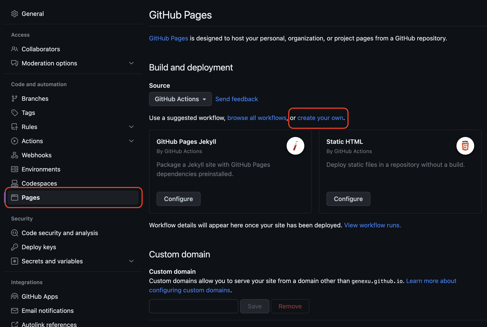
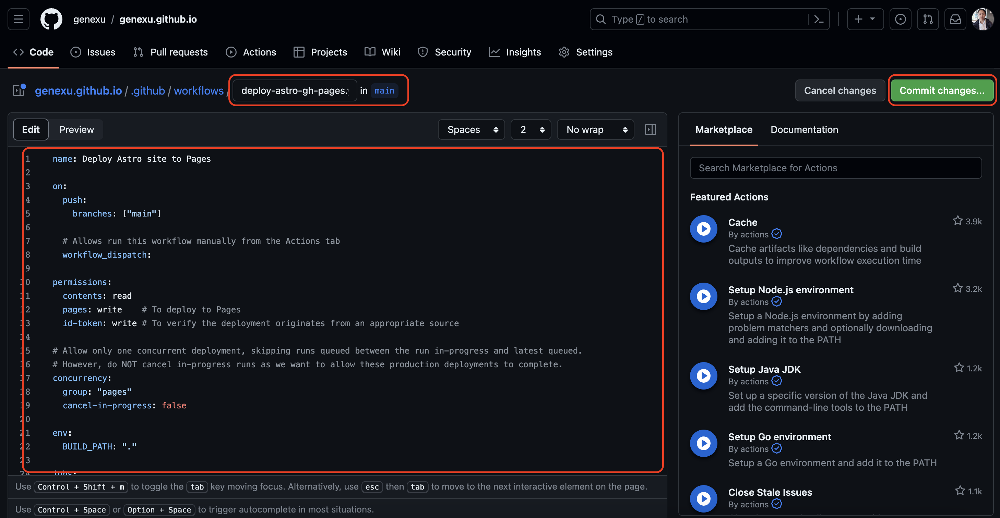

### What is Astro

Astro is a frontend framework that emphasizes a content-first approach and introduces the concept of Component Islands. It seamlessly integrates with various frameworks like React, Vue, Svelte, and more, allowing developers to choose the framework they are most comfortable with for development.

This is why, as someone who enjoys experimenting with different frameworks and wants to create a blog, I chose Astro to build my personal website.


### Create Astro Project

<https://docs.astro.build/en/install>

```bash
~$ yarn create astro
```


### Push Astro Project to Github



### Configure Github Pages

Access the Repository's Settings, locate GitHub Pages, and configure the Source to be GitHub Action. Click on "Create your own" to set up a new workflow.



### Configure Github Action Workflow

Here, I have already configured the workflow, so you can simply copy and paste it.
[workflows/deploy-astro-gh-pages.yml](https://github.com/genexu/genexu.github.io/blob/main/.github/workflows/deploy-astro-gh-pages.yml)




### Deploy Astro Project to Github Pages

Boom! That's it. From now on, every time you push to the main branch, GitHub Action will automatically build and deploy to GitHub Pages.

Click on "Actions" to see the workflow you just set up. The current configuration is set to trigger deployment whenever there's a new commit pushed to the main branch. You can also manually trigger it by clicking "Run workflow."


From setup to deployment, it's just that simple. To keep this post from getting too complicated, I'll explain the GitHub workflow configuration in a future article. If you're interested, you can follow up later.