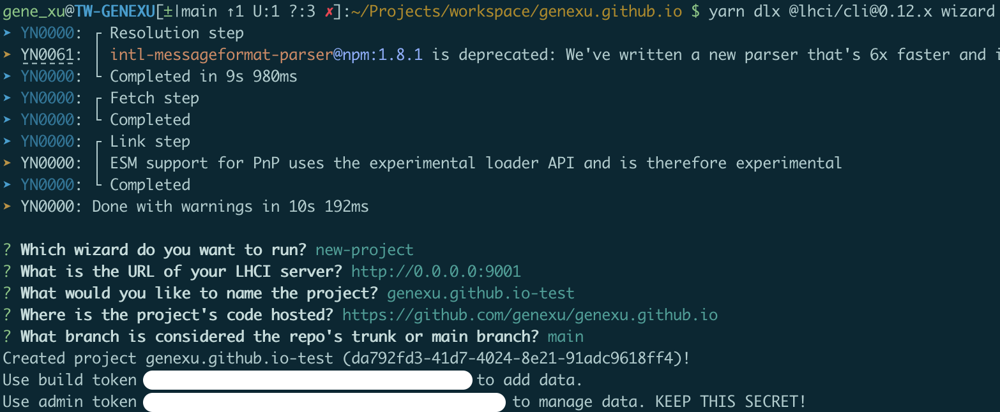

### Setting Up the Lighthouse CI Server

First, let's set up the Lighthouse CI Server. In this tutorial, we will use Docker to quickly establish the server and demonstrate how to use Lighthouse CI. You can customize the setup to match your specific requirements.

ref: <https://github.com/GoogleChrome/lighthouse-ci/blob/main/docs/server.md#docker>

```bash
docker volume create lhci-data
docker container run --publish 9001:9001 --mount='source=lhci-data,target=/data' --detach patrickhulce/lhci-server
```

Open your web browser and enter <http://localhost:9001> to access the Lighthouse CI Server interface.


### Creating a Lighthouse CI Project

Use the <code>lhci wizard</code> command to configure your project and obtain the token.

```bash
yarn dlx @lhci/cli@0.12.x wizard
```



### Configuring the lighthouserc.json File

Configure the CI Upload Target, Server Base URL, and fill in the Token.

```json
{
	"ci": {
		"upload": {
			"target": "lhci",
			"serverBaseUrl": "http://0.0.0.0:9001",
			"token": "YOUR_LHCI_SERVER_BUILD_TOKEN"
		}
	}
}
```

### Running Lighthouse CI

Execute Lighthouse CLI autorun with the specified configuration file, and you will see that it ultimately uploads the report to the Lighthouse CI Server.

```bash
yarn dlx @lhci/cli@0.12.x autorun --config=lighthouserc.json
```


### Lighthouse CI Server Report

On the Lighthouse CI Server, you can view reports with a timeline, allowing you to continuously track changes in performance metrics.


By accessing the detail page, you can further compare reports and metric changes between different versions.


Using the Lighthouse CI Server, you can consistently monitor and compare performance metrics. It offers a user-friendly interface that enables users to intuitively understand the performance changes of website applications, facilitating continuous optimization.
