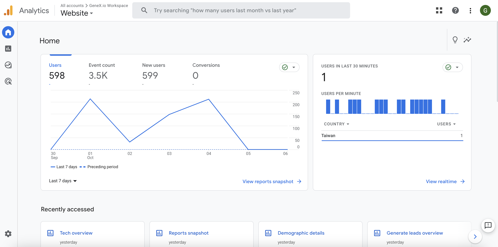

### What is Partytown

Partytown 是一個 lazy-loaded 的 library，協助你將網站中資源密集的 script relocate 到 web worker 中執行，避免阻塞 main thread，進而提升應用的效能。

### 安裝 Partytown

ref: <https://partytown.builder.io/astro>

```bash
~$ yarn astro add partytown
```

```js
import { defineConfig } from "astro/config";
import partytown from "@astrojs/partytown";

export default defineConfig({
	site: "YOUR_SITE_URL",
	integrations: [partytown()],
});
```

### 建立 Google Analytics component

建立一個 Google Analytics component，方便後續使用。

**Note**:

-   加入 type="text/partytown" 屬性到各個要應用 Partytown 的 third-party \<script\> tag 中，這樣 Partytown 才會將這些 script 移到 web worker 中執行。
-   設置 define:vars={{ id }} 這個屬性是為了將 Astro.props.id 傳入到 \<script\> 中，這樣才能使用 Astro.props.id 來設置 Google Analytics 的 id。

ref: <https://partytown.builder.io/partytown-scripts>

```astro
---
interface Props {
	id: string;
}

const { id } = Astro.props;
---
<!-- Google tag (gtag.js) -->
<script is:inline async
    type="text/partytown"
    src=`https://www.googletagmanager.com/gtag/js?id=${id}`
>
</script>
<script is:inline
    define:vars={{ id }}
    type="text/partytown"
>
	window.dataLayer = window.dataLayer || [];
	function gtag() {
		dataLayer.push(arguments);
	}
	gtag("js", new Date());

	gtag("config", id);
</script>
```

### 設定 Google Analytics 並取得 Google Analytics ID


### 將 Google Analytics component 加入到網站中

```astro

<head>
    <!-- Google Analytics (use Google tag) -->
    <GoogleAnalytics id="G-EM82W78TKM" />
    ...
</head>
```

### 設定 Partytown forward config

要與 Third-party script 溝通時，其經常將變數加入到 "window" 當中，而此時我們的 Third-party script 已經被 Partytown 移到 web worker 中執行，因此我們需要透過 Partytown 的 forward config 來將這些變數轉發到 web worker 中。

ref: <https://docs.astro.build/en/guides/integrations-guide/partytown/#configforward>

```js
import { defineConfig } from "astro/config";
import partytown from "@astrojs/partytown";

export default defineConfig({
	site: "YOUR_SITE_URL",
	integrations: [
		partytown({
			config: {
				forward: ["dataLayer.push"],
			},
		}),
	],
});
```

### 確認 Google Analytics 正常運作



這裡專注於專案內的設置，Google Analytics 的設定可以參考官方文件，有機會再寫一篇文章來說明如何設定 Google Analytics。
