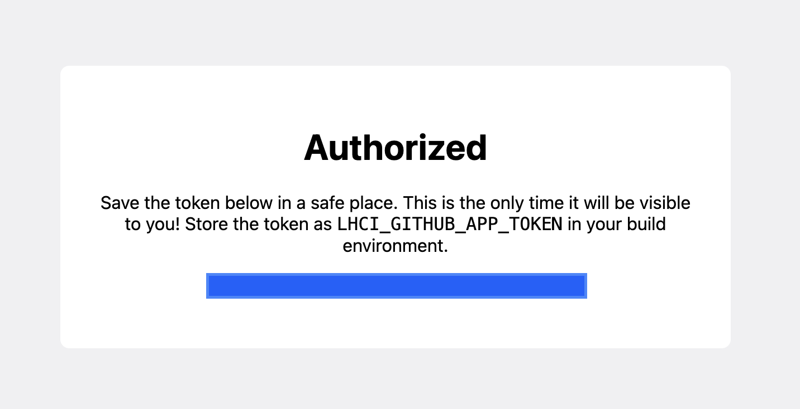
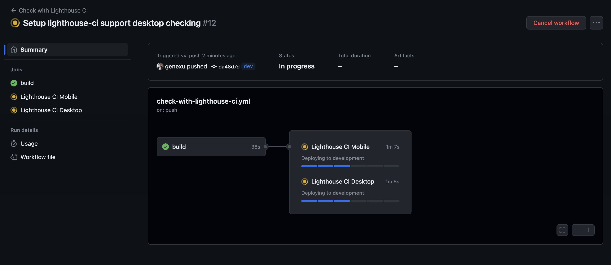
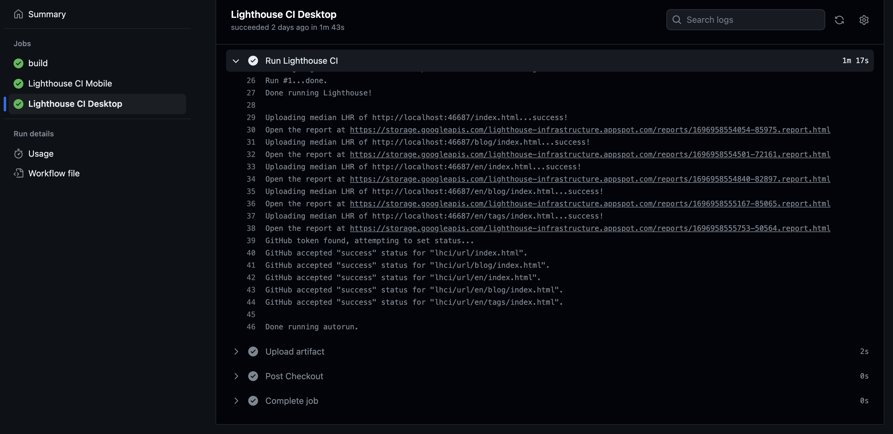

### 安裝 Lighthouse CI GitHub App 並取得 Token

ref: <https://github.com/GoogleChrome/lighthouse-ci/blob/main/docs/getting-started.md#github-app-method-recommended>

Github App: <https://github.com/apps/lighthouse-ci>



### 建立 Repository Secret

建立 Repository Environment Secret，名稱為 <code>LHCI_GITHUB_APP_TOKEN</code>，將前一步驟取得的 Token 鍵入


### 建立 GitHub Action Workflow

於專案目錄下新增 <code>.github/workflows/check-with-lighthouse-ci.yml</code>，此處 Workflow 主要分為兩部分，第一部分為 Build & Cache，第二部分為執行 Lighthouse CI，可依照專案需求調整

ref: [check-with-lighthouse-ci.yml](https://github.com/genexu/genexu.github.io/blob/main/.github/workflows/check-with-lighthouse-ci.yml)

#### Build & Cache

Build 的部分根據專案的需求而定，不外乎於安裝相依套件、建置專案、部署專案等，此處略過 Build 來說明 Cache 的部分

```yaml
- name: Cache Dest
  id: cache-dest
  uses: actions/cache@v3
  with:
      path: ${{ env.BUILD_PATH }}/dist
      key: ${{ runner.os }}-${{ github.run_number }}-dest
```

此處 Cache 的主要用意是將 Build 完成的 Filepath 進行快取，並在不同的 Job 間共用，以加速 Workflow 的執行速度，若 Cache key 相同，則會使用 Cache，若 Key 不同，則會重新建立

以此處來說，將會 Cache <code>/dist</code> 目錄，並以 <code>runner.os</code> 與 <code>github.run_number</code> 當作 Key

#### Lighthouse CI

-   Restore Cache
-   Install & Run Lighthouse CI
-   Report & Artifact

將前一步驟 Cache 的 Filepath 進行 Restore 至當前的 Job 當中

```yaml
- name: Restore cached dest
  id: cache-dest-restore
  uses: actions/cache/restore@v3
  with:
      path: ${{ env.BUILD_PATH }}/dist
      key: ${{ runner.os }}-${{ github.run_number }}-dest
```

安裝 Lighthouse CI 並執行，此處將 Desktop & Mobile 分開並行執行，主要的不同點僅在於設定檔的不同，預設路徑是 lighthouserc.json (Mobile)

```yaml
- name: Install LHCI
  working-directory: ${{ env.BUILD_PATH }}
  run: |
      yarn global add @lhci/cli@0.12.x

- name: Run Lighthouse CI
  run: |
      lhci autorun
  # lhci autorun --config=lighthouserc-desktop.json
  env:
      LHCI_GITHUB_APP_TOKEN: ${{ secrets.LHCI_GITHUB_APP_TOKEN }}
```

#### 設定 lighthouserc.json 檔案

-   Mobile: [lighthouserc-mobile.json](https://github.com/genexu/genexu.github.io/blob/main/lighthouserc.json)
-   Desktop: [lighthouserc-desktop.json](https://github.com/genexu/genexu.github.io/blob/main/lighthouserc-desktop.json)

```json
{
	"ci": {
		"collect": {
			"numberOfRuns": 1,
			"settings": {
				"preset": "desktop"
			}
		},
		"upload": {
			"target": "temporary-public-storage"
		}
	}
}
```

這邊可以根據自身需求調整設定，相關設定可參考官方文件
ref: <https://github.com/GoogleChrome/lighthouse-ci/blob/main/docs/configuration.md>

至此就完成了 Lighthouse CI 的設定，接下來就可以將專案推送至 GitHub 並觀察 Workflow 的執行結果

### Workflow 執行結果



上述的設定 <code>temporary-public-storage</code> 會將 Report 儲存至 Google 提供的暫存空間，並提供網址供查看，公開且會自動於一定時間後刪除

這邊可以於 Workflow 中設定上傳 Lighthouse CI Report 儲存至 GitHub Action Artifact 備存，Artifact 儲存空間、天數等可以由使用者自行設定

```yaml
- name: Upload artifact
  uses: actions/upload-artifact@v3
  with:
      name: lighthouseci-report-mobile
      # name: lighthouseci-report-desktop
      path: ${{ env.BUILD_PATH }}/.lighthouseci
```


目前的方式查看 Report 並不是很方便，可以透過 Lighthouse CI 提供的 Server 來查看、並比較各個版本的 Report、指標變化等，後續將於另一篇文章介紹架設 Lighthouse CI Server 以及相關設定
